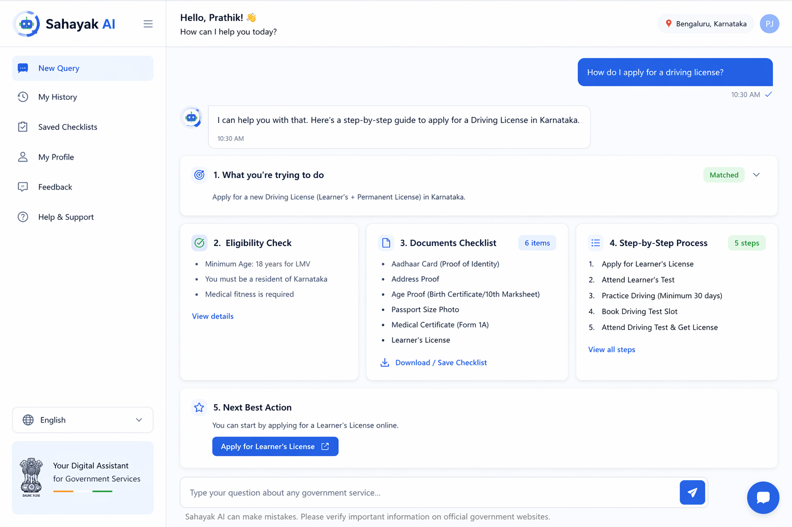
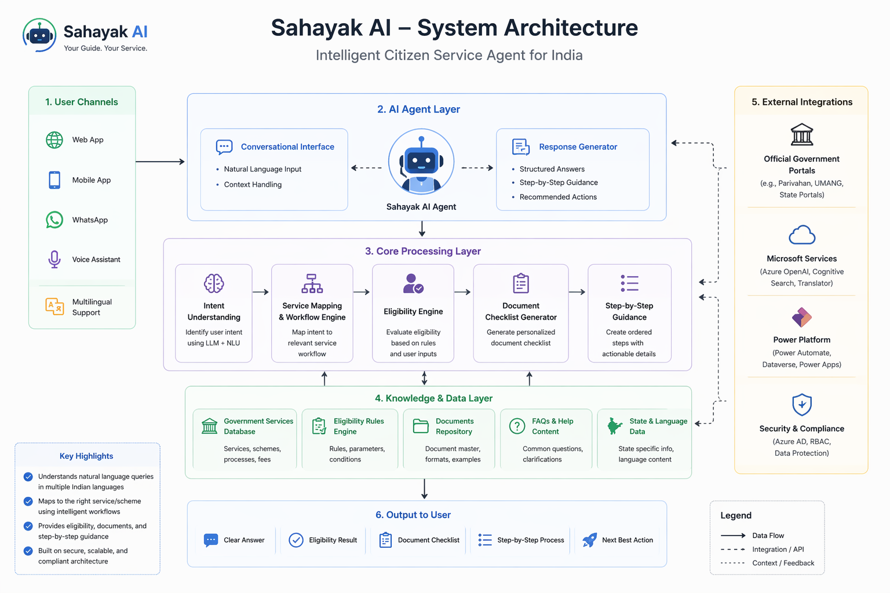
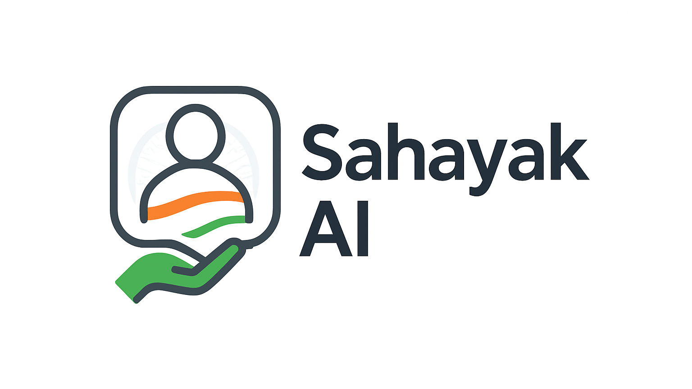

# Sahayak AI – Intelligent Citizen Service Agent for India

## Overview
Sahayak AI is an AI assistant designed to simplify access to government services in India.

It helps users understand processes, check eligibility, and identify required documents through a structured and easy-to-follow approach.

---

## Problem
Accessing government services often involves:
- Unclear steps  
- Eligibility confusion  
- Missing documents  

This leads to delays and repeated effort.

---

## Solution
Sahayak AI allows users to ask simple questions and provides:
- Clear step-by-step guidance  
- Required document checklist  
- Basic eligibility information  

---

## Key Features
- Natural language queries  
- Structured workflow responses  
- Document checklist generation  
- Simple, user-friendly interface  

---

## Screenshots

---

## Architecture

---

## Logo

---

## Future Enhancements
- More services coverage  
- Multilingual support  
- Integration with official portals  

---

## Disclaimer
This project uses publicly available information and does not handle confidential data.

---

## Author
Developed for Microsoft Agents League Hackathon 2026
